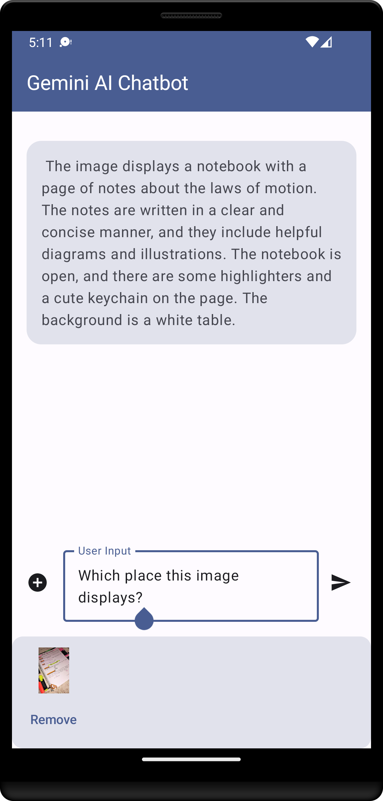

# GeminiAiChatbot

GeminiAiChatbot is an app built using Kotlin and Jetpack Compose. It demonstrates the use of Generative AI SDK for Android. It features a simple chat based UI and experience to interact with AI.

## Libraries used

* Jetpack Compose 
* Generative AI Sdk

## Pre-requisites

* Java JDK 17+
* Latest stable version of Android Studio IDE
* Latest XCode (for iOS)
* Gemini API Key ([Click here](https://aistudio.google.com/app/apikey) to get it)

## Screenshot

## Setup

Clone this repository.
Open in the latest version of Android Studio.
Place your Gemini API key in local.properties file as apiKey property.

Example:

`apiKey=YOUR_API_KEY`
